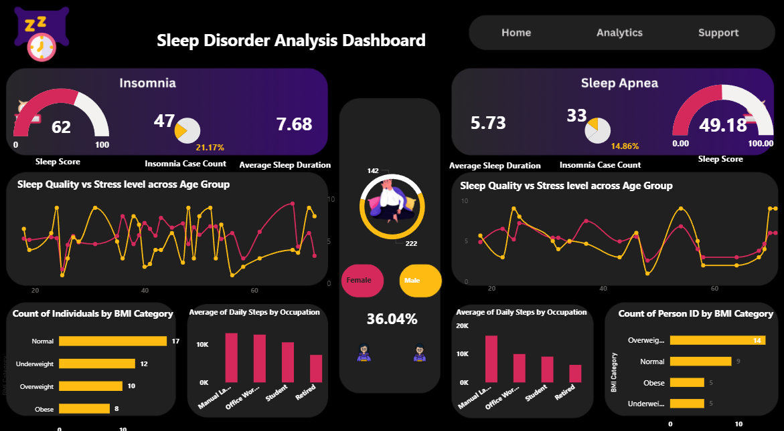
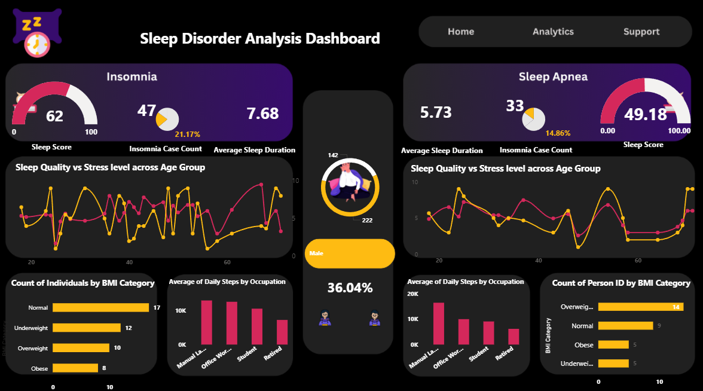

# 💤 Sleep Disorder Analysis Dashboard

## 📌 Project Overview

The Sleep Disorder Analysis Dashboard is an interactive Power BI project designed to analyze sleep patterns, sleep quality, stress levels, BMI categories, daily activity, and the prevalence of sleep disorders such as Insomnia and Sleep Apnea.

The dashboard helps identify key factors influencing sleep health and provides actionable insights through interactive visualizations.

---

## 🎯 Business Objective

The objective of this project is to:

- Analyze factors affecting sleep quality.
- Compare Insomnia and Sleep Apnea cases.
- Study the impact of stress levels on sleep.
- Evaluate sleep patterns across different occupations.
- Identify BMI categories associated with sleep disorders.
- Support data-driven health and wellness decisions.

---

## 🛠️ Tools & Technologies

- Power BI
- DAX
- Data Modeling
- Power Query
- Excel

---

## 📊 Dashboard Pages

### 1️⃣ Overview Dashboard

Provides a high-level view of:

- Sleep Score
- Average Sleep Duration
- Insomnia Cases
- Sleep Apnea Cases
- BMI Distribution
- Daily Steps Analysis
- Stress Level vs Sleep Quality

---

### 2️⃣ Male Sleep Analysis

Analyzes:

- Sleep Quality Trends
- Stress Level Impact
- BMI Distribution
- Occupation-wise Activity Levels
- Sleep Disorder Statistics

---

### 3️⃣ Female Sleep Analysis

Analyzes:

- Sleep Quality Trends
- Stress Level Impact
- BMI Distribution
- Occupation-wise Activity Levels
- Sleep Disorder Statistics

---

## 📈 Key Insights

- Higher stress levels generally correspond to lower sleep quality.
- Sleep duration differs significantly across occupations.
- Obese and overweight individuals show a higher occurrence of sleep disorders.
- Daily physical activity appears to positively influence sleep quality.
- Sleep Apnea and Insomnia exhibit different behavioral patterns across demographics.

---

## 📷 Dashboard Screenshots

### Overview Dashboard



### Male Analysis Dashboard



### Female Analysis Dashboard


---

## 📂 Repository Structure

```
Sleep-Disorder-Analysis-Dashboard
│
├── README.md
├── sleep disorder dashboard project.pbix
└── images/
    ├── overall trends.png
    ├── male_specific_insights.png
    └── female_specific_insights.png
```

---

## 🚀 Future Enhancements

- Predictive Sleep Disorder Analysis
- Machine Learning Models
- Advanced Health Risk Scoring
- Interactive Drill-through Reports
- Real-time Health Monitoring Dashboard

---

## 👨‍💻 Author

### Rituraj Kalkhudiya


Aspiring Data Analyst | Power BI Developer

**Skills:** SQL • Power BI • Python • Excel • Data Visualization

---

⭐ If you found this project useful, feel free to star the repository.
